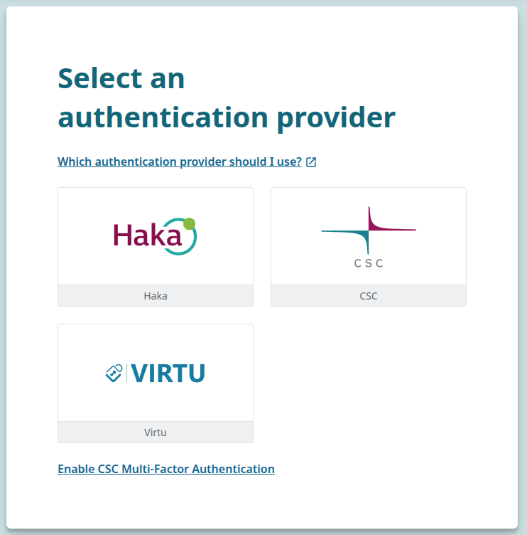
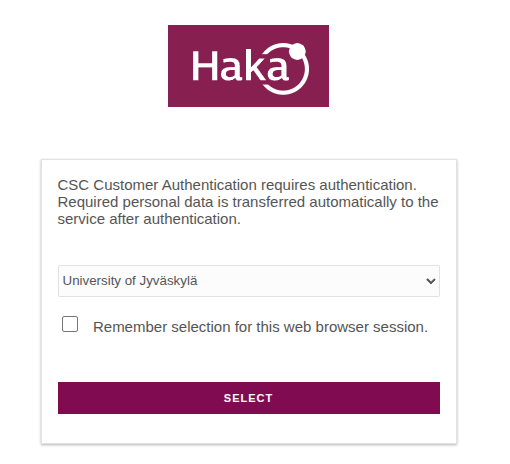
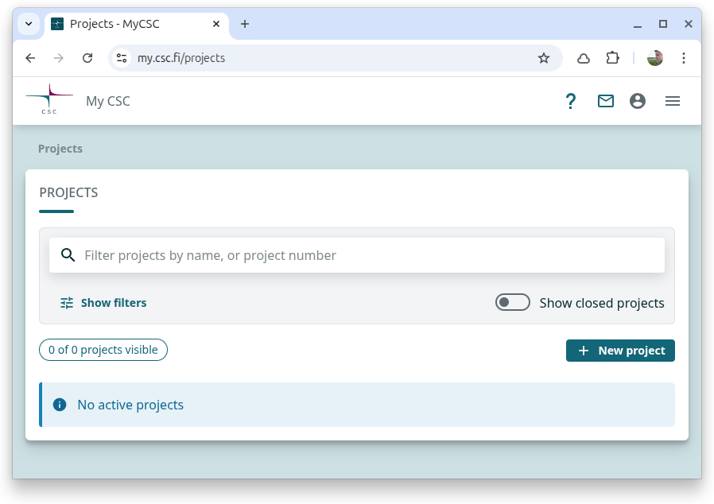
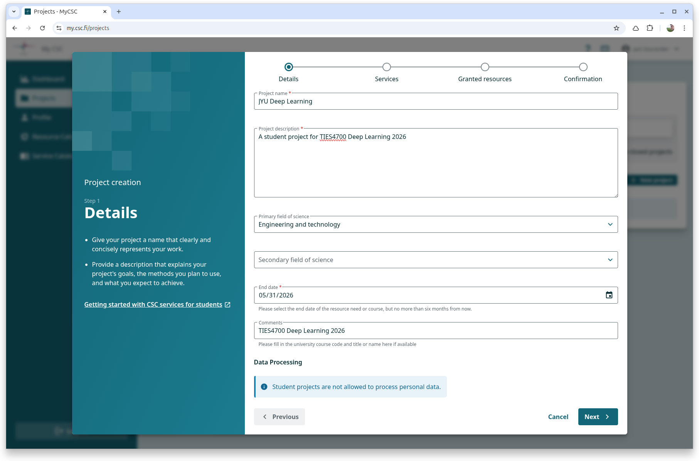
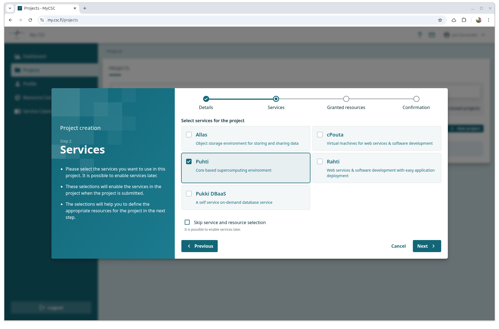

# Steps for creating a project

Assuming if you created your CSC account and have access to MyCSC, you can create a project by following the steps below:

**Login to MyCSC with your CSC user account or Haka/Virtu account.**

The steps are the same as in [Creating a new project > Student](https://docs.csc.fi/accounts/how-to-create-new-project/#student) page, but fewer, and prettier pictures.

**Fig:** Choose HAKA as the login method.

**Fig:** Choose your university from the list. You will be redirected to your university's login page.

---

**Projects from the left menu -> + New project.**

**Fig**: Click the `+ New Project` button. You can find this page by clicking Projects in the left panel menu. The menu is hidden in this image due to narrow screen size.

**Fill in the details**

**Fig:** Fill in the details. Fill also the Secondary field of science, unlike in the image.

**Fig:** Choose Puhti service. Puhti is a supercomputer that is currently in it's End of Life. If you are reading this after Q2/2026, choose Roihu instead. It is the successor.

You will receive:

* 60 000 cpu billing units
* 10 000 gpu billing units
* 30 000 storage billing units

The are a virtual unit, like Monopoly money. There are no actual costs being generated (for you).

**Please read our terms and conditions and confirm your acceptance.
Click Create project.**

Assuming there was nothing in the Toc that prevented you from accepting them, the Project is now created. Return back to [../README.md](../README.md)