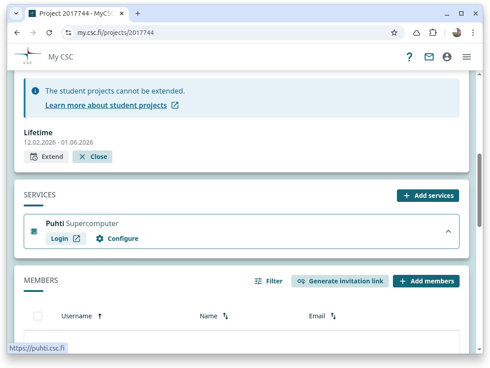
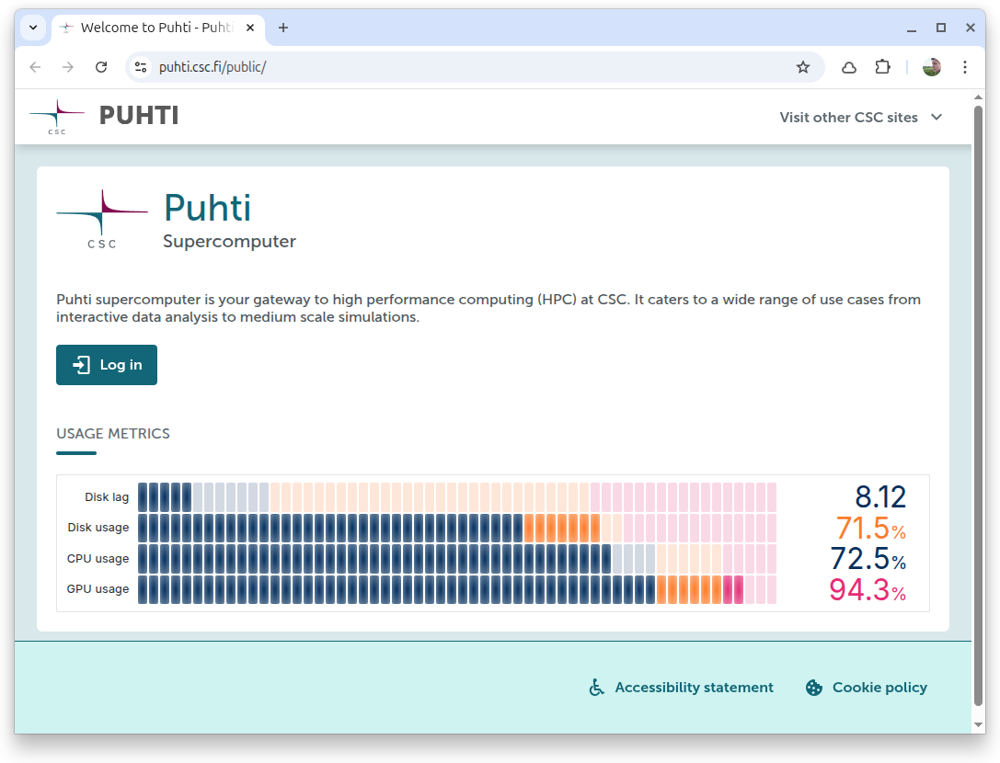
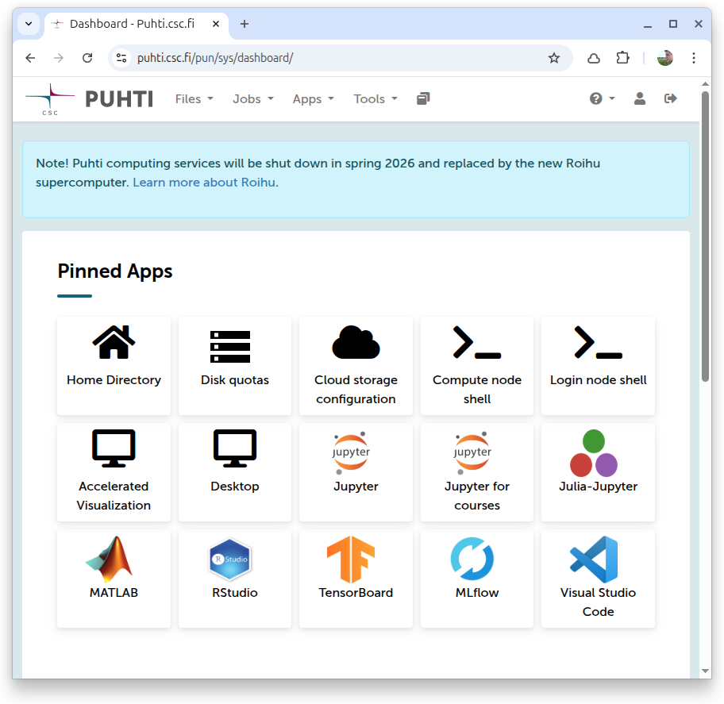
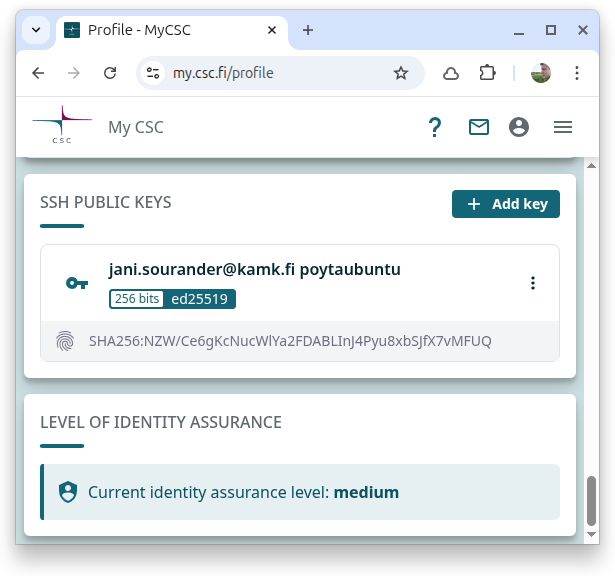
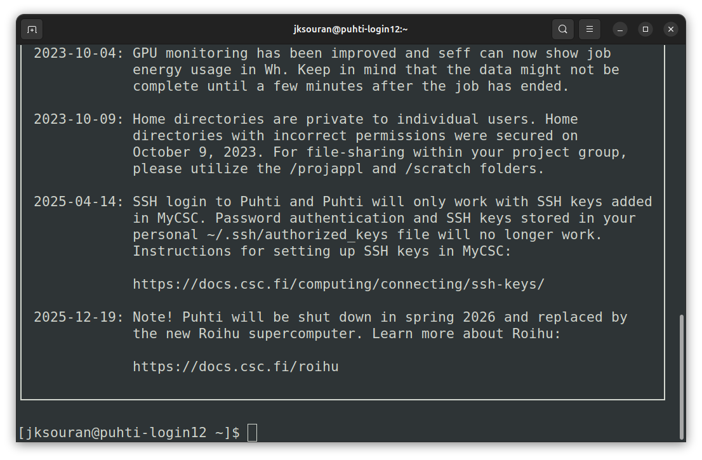

# Accessing Puhti

## Project Login



**Fig:** Once your student project has been created, find the **Puhti Supercomputer** in the Services panel and choose 'Login'.



## Test Puhti Availability

**Fig:** The login screen displays current resource usage.



**Fig:** A successful login will show Pinned interactive (containerized) apps. If login fails, verify your credentials or wait a few minutes if you just created the account.

!!! note

    We will not be using these interactive services in this tutorial. While tools like TensorBoard or MLflow are useful, we will focus on using **Slurm** to run training scripts from the command line.

## Setting up SSH Access

To interact with Puhti efficiently via the command line, setting up SSH keys is highly recommended. This allows for secure authentication without typing your password each time.



**Fig:** In the MyCSC portal, navigate to your profile settings to add your SSH public key.

??? guide "How to add an SSH key? (Click to expand)"

    ### 1. Generate an SSH Key Pair

    If you don't have an SSH key pair yet, open your **local** terminal and run:

    ```bash
    ssh-keygen -t ed25519 -C "your_email@example.com"
    ```

    Press `Enter` to save the key to the default location (`~/.ssh/id_ed25519`). It is recommended to set a passphrase.

    ### 2. Add the Public Key to CSC

    Next, provide your **public key** to the service.

    1.  Display your public key content:
        ```bash
        cat ~/.ssh/id_ed25519.pub
        ```
    2.  In the MyCSC portal (or the specific service view shown above), navigate to your **Profile** or **Settings**.
    3.  Find the **SSH Public Keys** section.
    4.  Add a new key and paste the full output from the `cat` command.

    For further instructions, refer to the [Setting up SSH keys](https://docs.csc.fi/computing/connecting/ssh-keys/) documentation.


### Connect to Puhti

You can now directly connect to the login node using your CSC username.

```bash
ssh <username>@puhti.csc.fi
```

!!! warning

    **Important:** The login node is shared by all users. **Do not run heavy calculations here!**

To make connecting easier, configure your SSH config file (`~/.ssh/config`) with the following:

```bash
Host puhti
    HostName puhti.csc.fi
    User your-username
```

With this configuration, you can simply connect using:

```bash
ssh puhti
```

??? tip "Windows Users (PowerShell / WSL)"
    The steps above work perfectly if you are using:

    * **WSL (Windows Subsystem for Linux)**: Recommended for Windows users as it mimics Linux usage.
    * **PowerShell**: Recent versions of Windows 10/11 come with OpenSSH client installed by default.
    * **Git Bash**: Comes with Git for Windows.

    If you prefer a GUI, you can use **VS Code with the Remote - SSH extension**, which uses this same `~/.ssh/config` file under the hood.



**Fig:** A successful login displays the Message of the Day (MOTD) with system status and usage tips.


## Puhti Essentials

You have succesfully connected to Puhti! Before you start running your training scripts, there are some key concepts you need to understand about the environment. Best place to learn is the CSC's own documentation and training site, but here are the very minimum TLDR you need to know to get started.

### Storage and Login Node

* **Login Node:** 
    * The node you initially connect to. It is shared by all users. 
    * **Do not** run heavy calculations here!
* **Storage Areas:**
    * **home** (`/users/yourname/`): Small personal files, configuration files, helper scripts.
    * **projappl** (`/projappl/project_123`): Project-specific applications and libraries.
    * **scratch** (`/scratch/project_123`): Temporary storage for large datasets and job outputs. **Use this for reading/writing during training.** Files here are not backed up and may be cleaned up automatically.

**Quotas:**

| Storage Path          | Max Files | Size Limit |
| --------------------- | --------- | ---------- |
| /users/yourname/      | 100k      | 10 GB      |
| /projappl/project_123 | 100k      | 50 GB      |
| /scratch/project_123  | 1M        | 1 TB       |

Read more: [Data storage for machine learning](https://docs.csc.fi/support/tutorials/ml-data/)

### Running Code

* **Module System:** Puhti uses a module system to manage software versions. Load the necessary modules before running your code. In this tutorial, we will use the `pytorch` module which provides a PyTorch environment with GPU support.
    * `module avail` : See available modules.
    * `module load <module_name>` : Load a module.
    * `module list` : See currently loaded modules.
* **Containers:** Puhti uses Apptainer (formerly Singularity) for containerized environments. You can use CSC's pre-built containers or build your own, but for this tutorial we will stick to the provided PyTorch module.
* **Slurm Workload Manager:** You do not run training scripts directly on the login node. Instead, you submit **batch jobs** to Slurm.

### Recommended Training

The [CSC Computing Environment](https://csc-training.github.io/csc-env-eff/) course on the CSC Training site is highly recommended. It covers everything you need to know to get started effectively.