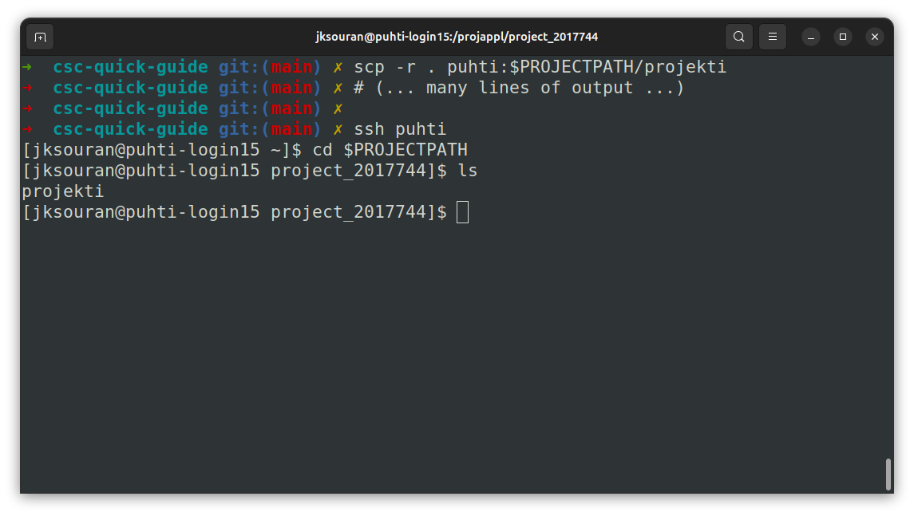

# Moving Files to Puhti

## Variables

In this section, we assume the following environment variables are used as examples:

```bash title="Note: Local and Puhti paths"
PROJECTPATH=/projappl/project_1234567
SCRATCHPATH=/scratch/project_1234567
```

!!! tip

    Replace the number in the project name with the actual project number you have access to. The prefix `project_` is important and should not be omitted.

## SCP

You *can* use graphical file transfer tools, but using the command line is recommended for efficiency. The `scp` command uses the same SSH protocol as `ssh`, allowing you to use your existing SSH keys.

```bash
# On your LOCAL machine
cd path/to/this/repo
scp -r . puhti:$PROJECTPATH
```



**Fig:** Using `scp` to copy files from a local machine to Puhti. The `-r` flag enables recursive copying for directories. 

!!! tip

    If your code is in GitHub, you can also clone the repository directly on Puhti to avoid unnecessary copying. Then simply `git pull` to update your code after making changes locally.

!!! warning

    Please do not place large files into Github. Use e.g. Hugging Face or copy them using `scp` once.