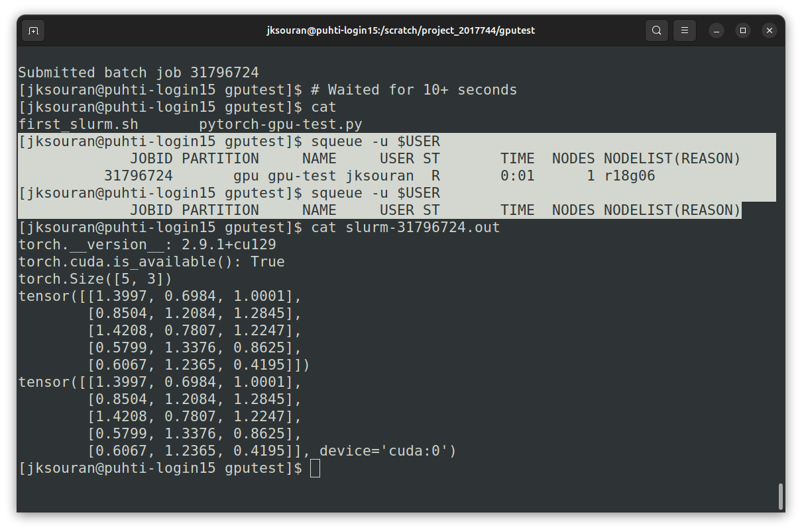
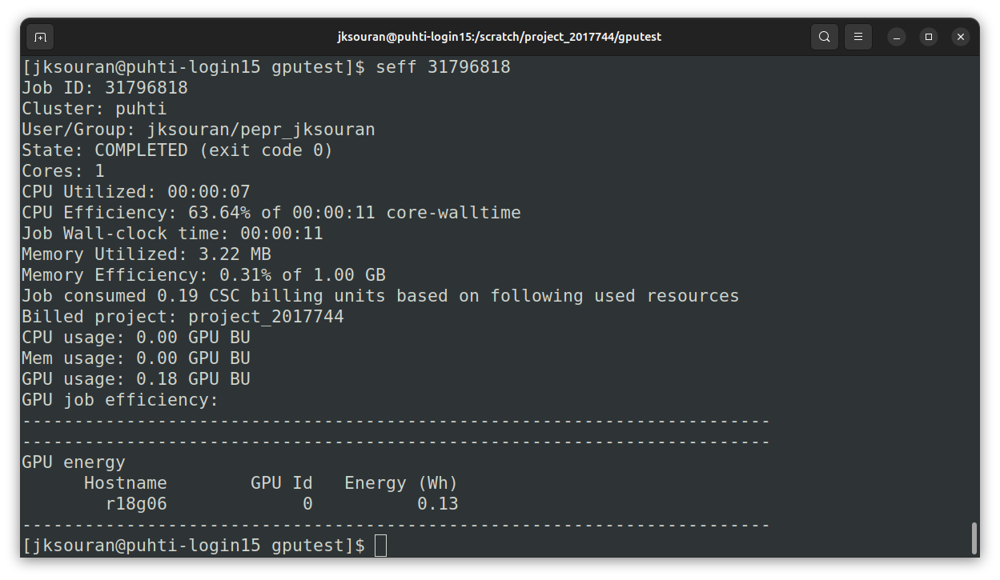

# Test GPU

## Fetch Test Script

To verify GPU access, we will use an example script from CSC's repository. This script, `pytorch-gpu-test.py`, verifies that PyTorch can see and use the GPU.
```bash
ssh puhti
cd $SCRATCHPATH
mkdir gputest && cd gputest
URL='https://raw.githubusercontent.com/CSCfi/machine-learning-scripts/refs/heads/master/examples/pytorch-gpu-test.py'
curl $URL -O
```

## Create Slurm Script

Create a file called `first_slurm.sh` with the content below. You can use `nano first_slurm.sh` or `vim first_slurm.sh` on Puhti to create the file.

```bash title="first_slurm.sh"
#!/bin/bash
#SBATCH --job-name=first_test
#SBATCH --account=project_CHANGE_ME
#SBATCH --partition=gputest
#SBATCH --ntasks=1
#SBATCH --nodes=1
#SBATCH --cpus-per-task=10
#SBATCH --mem=64G
#SBATCH --time=00:15:00
#SBATCH --gres=gpu:v100:1

module load pytorch
srun python pytorch-gpu-test.py
```

### Understanding Slurm Flags

Here is a breakdown of the `#SBATCH` flags you may encounter. These tell the scheduler what resources you need.

!!! warning "Do not blindly copy values!"

    Think, and use the values that are appropriate for your specific job and project. Always check your project number.

| Flag              | Example Value     | Description                                                        |
| :---------------- | :---------------- | :----------------------------------------------------------------- |
| `--account`       | `project_2001659` | **Change this!** Your specific Project ID.                         |
| `--partition`     | `gputest`         | Partition or "queue" name. Use `gputest` or `gpu`.                 |
| `--ntasks`        | `1`               | How many copies of the script to run. 1 is correct for single GPU. |
| `--cpus-per-task` | `10`              | CPU cores. 10 is a balanced amount for 1 GPU.                      |
| `--mem`           | `64G`             | RAM. 64G is sufficient for most single-GPU jobs.                   |
| `--time`          | `00:15:00`        | Max runtime (`hh:mm:ss`). `gputest` limit is 15 min.               |
| `--gres`          | `gpu:v100:1`      | Request 1 Nvidia V100 GPU.                                         |

!!! tip "What is available?"

    A single GPU node on Puhti consists of:

    - **CPU:** 2 x 20 cores (40 cores, or "CPU"s, total)
    - **GPU:** 4 x Nvidia V100 (32GB memory each)
    - **RAM:** 384 GB total

    By requesting 10 CPUs and 1 GPU, you are essentially asking for **1/4th of a node**. This is a balanced request because the node has 4 GPUs and 40 cores (40 / 4 = 10 cores per GPU).

    **Partitions:**
    - `gputest`: For short tests (max 15 mins). Good for debugging.
    - `gpu`: For actual training runs (max 3 days).

    > **Read more:** [Creating a batch job script for Puhti](https://docs.csc.fi/computing/running/creating-job-scripts-puhti/)

### Submit Job



**Fig:** Use `sbatch first_slurm.sh` command to submit the job to Slurm. Note that even small jobs may enter a queue.

- Check status: `squeue -u $USER`
- Once finished, checking output: `cat slurm-[jobid].out`

### Check Stats



**Fig:** Use `seff <jobid>` to check CPU and GPU usage stats after the job completes.

!!! tip

    If you want to see the output of `nvidia-smi` during the job, add the following line to your Slurm script:

    ```bash
    # Find nodename
    squeue -u $USER
    
    # One-time SSH into the node to check GPU status
    ssh <nodename> nvidia-smi
    ```
